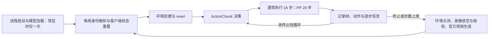

# OOD 动作块与单局占用时间分析

结论：FrameSamp、Oracle、PonderPounce 的完整局耗时主要落在决策之外，尤其是媒体收尾；SimpleMemVLA 的约六分钟由约一百秒决策与约二百六十五秒其它工作组成；MemER 的约二十七分钟主要由语言／子目标决策累积而来。常驻省掉重复加载，但不会自动省掉每局录像和官方视频生成。本报告只读已有结果，没有新评估、reset、模型调用或集群工作负载。

## 一 范围与统计口径

用户原话：「你再给我分析一下这个，每一个 action chunk 的时间，以及就是为什么一局需要三分钟或者六分钟，就是你帮我分析清楚了，也是画在这一个表格内，然后给我一个完整的报告。」

目标规模沿用已批准 OOD 清单：7 任务 × 2 档 × 25 局 + 2 任务 × 4 档（13/13/12/12 局）+ 3 任务 × 3 档（17/17/16 局）+ 2 任务 × 5 档 × 10 局 = 每模型 700 局；6 模型 × 700 局 × 1 seed = 4200 局。排除 Astra、MoveCube、InsertPeg，不测 hard-verify。

分析源为停止时共享盘的已有结果 `/nfs/turbo/coe-chaijy-unreplicated/hongzefu/artifacts/full-eval-20261010/seed7/rollouts/`。读到 275 份结果，排除六份既有最小冒烟及两份基础设施结果，剩 267 份有策略计时的 OOD 结果；全部正常任务失败和步数上限局均保留，不挑成功局。各模型覆盖任务不同，下表不是同一身份的速度对拍。

完整单局用 `t_end-t_start`：包括身份解析、客户端 reset、环境创建、执行、录像关闭与官方视频生成；不含先前 `Policy.load()`，也不含随后写 result.json、另行产物搬运和外部完整视频核验。单局均值先按任务求均值，再在已覆盖任务间等权；未覆盖任务的外推沿用已覆盖任务均值。

ActionChunk 用 `timing.policy.chunks[].decision_wall_ms`，包括当前决策区间内的语言／子目标、动作请求、通信、打包与等待。稳态排除每局原始序号前三块，之后所有块合并求均值和 P95。累计决策时间则包含前三块。稳态块均值和每局均值权重不同，不能把两个均值简单相乘当精确拆分。

## 二 合并统计表

动作块时间单位为秒，其它时间单位同列标注。单局拆分“累计决策 + 其它”与完整局守恒；PP 的决策列为成本归集，需结合第三节理解。

| 模型 | 样本局／覆盖任务 | 每块通常执行步数 | 稳态块均值／P95（秒） | 每局平均步数／块数 | 每局累计决策（秒） | 每局其它（秒） | 完整一局（分钟） | 700 局占用（小时） | 为什么需要这么久 |
| --- | --- | --- | --- | --- | --- | --- | --- | --- | --- |
| FrameSamp＋Modulation | 41／9 | 16 | 0.246／0.266 | 553／35.1 | 10.7 | 187.0 | 3.30 | 38.5 | 推理快；录像回调约 47 秒，外层收尾约 126 秒 |
| SimpleMemVLA | 54／11 | 16 | 2.181／2.455 | 726／45.9 | 100.9 | 265.3 | 6.10 | 71.3 | 每约 16 步重复决策；外层收尾约 225 秒，常驻不消除收尾 |
| PonderPounce | 68／14 | 20 | 0.864／1.882 | 540／27.2 | 28.7 | 313.8 | 5.71 | 66.6 | 外层收尾约 219 秒；另有非 fresh chunk 的客户端往返等路径 |
| GroundSG＋Oracle | 22／5 | 16 | 0.169／0.190 | 824／52.1 | 8.7 | 309.4 | 5.30 | 61.9 | 动作决策快；录像回调约 89 秒、外层收尾约 199 秒 |
| GroundSG＋QwenVL | 58／12 | 16 | 5.902／25.420 | 688／43.4 | 279.2 | 250.3 | 8.82 | 103.0 | 语言子目标调用使部分块显著变慢，外层收尾仍约 224 秒 |
| GroundSG＋MemER | 24／5 | 16 | 26.475／37.013 | 874／55.1 | 1422.6 | 219.4 | 27.37 | 319.3 | 决策约占整局 87%，语言／记忆子目标路径是主要耗时 |

700 局列另计一次既有模型加载；切换席位、作业到期后的重新加载另有开销。PP 本表要求完整策略计时，因此排除上下文耗尽且无完整计时的那份结果：先前估算 69 份样本约 65.9 小时，本次详细拆分 68 份样本约 66.6 小时，差异来自样本口径，不是运行速度改变。

## 三 为什么“每块很快”仍然“一局几分钟”



SimpleMemVLA 每局约 726 步，需要约 46 次决策，直接累计得到约 101 秒；剩余约 265 秒主要包含约 225 秒外层收尾、约 24 秒录像回调、约 15 秒环境工作和少量其它路径。合计约 366 秒，即 6.1 分钟。这里已扣除逐局加载的旧做法；模型加载约 235 秒应由常驻进程分摊，不能再加到每局上。

FrameSamp 每块仅约四分之一秒，平均约 35 块，累计决策约 11 秒；约 47 秒录像回调与约 126 秒收尾明显更大，完整局仍约 198 秒，即 3.3 分钟。因此仅加速动作网络，对这种局的总时间收益有限。

Oracle 同样只有约 9 秒累计决策，但局长约 824 步，录像与媒体工作较多，完整局约 318 秒。QwenVL 除动作网络还会产生语言子目标，决策累计约 279 秒；P95 约 25 秒说明均值约 6 秒不能代表每一次更新。MemER 平均约 55 块，直接累计决策约 1423 秒，完整局约 1642 秒；与前两种快动作模型的瓶颈不同。

PonderPounce 的 `PonderPouncePolicy._account` 将 fresh 动作响应 RTT 与自上一 fresh 块后累积的 S2 子目标成本归到一个块。它不是单个连续墙钟区间；非 fresh S1 调用及其它未归入块的路径仍在单局时间中。因此其“其它”列不能全部称为录像时间，也不能用块数乘 fresh RTT替代整局。

## 四 其它时间的进一步拆分与边界

| 模型 | 环境创建／reset／step／关闭（秒） | 录像回调（秒） | 外层收尾窗口（秒） | 未单独归因余量（秒） |
| --- | --- | --- | --- | --- |
| FrameSamp＋Modulation | 11.4 | 47.2 | 126.1 | 2.3 |
| SimpleMemVLA | 15.3 | 23.7 | 225.1 | 1.3 |
| PonderPounce | 15.4 | 36.1 | 218.5 | 43.8 |
| GroundSG＋Oracle | 14.6 | 89.3 | 199.1 | 6.4 |
| GroundSG＋QwenVL | 15.2 | 4.0 | 224.4 | 6.7 |
| GroundSG＋MemER | 12.9 | 0.9 | 174.6 | 31.0 |

这是现有字段的近似记账拆分，不能当作互不重叠的独立性能剖析。外层收尾窗口用完整局减 `episode_wall_s`，主要包含关闭、录像排空／核验与官方视频生成，也包含少量前置工作；环境关闭同时包含于环境字段和收尾窗口，余量因此不是严格的单一路径时间。现有记录没有独立官方视频渲染计时，不能把整个窗口都标成纯渲染。

录像回调包含帧／数组记录与队列阻塞，并非纯编码 CPU 时间。编码 worker 会在决策及仿真期间并行执行；`encode_cpu_s` 是另一个统计量，不能再与完整局墙钟相加。三路字段没有自动证明同一负载下编码开销固定；慢语言模型给编码更多并行时间，所以回调等待较少，不表示其视频产物更少或省略录像。

源码锚点：`episode.py::run_episode` 确定宽／窄两个计时窗口；`session.py::EnvSession.step/close` 记录步进和录像回调；`timing.py::ChunkTimer.close` 记录决策墙钟；`models/pp.py::PonderPouncePolicy._account` 定义 PP 成本归集。语言耗时可能是动作服务端推理的子集，禁止将 `lang_ms` 与 `action_rtt_ms` 无条件相加。

## 五 一个 seed 的总时间

按六模型均常驻、每模型 700 局外推，本次详细样本合计约 **660.5 GPU·小时**。四张 GPU 能持续分担同模型不同身份时，理想下限约 **165.1 小时，即 6.9 天**；实际安排仍建议 **8～9 天**，这个预留是排程估算而非实测置信区间，不含排队与额外基础设施重试。

必须让先完成的席位分担 MemER；若每模型固定只由一个席位执行且不分片，MemER 单独约 319 小时，即 13.3 天，不能简单把总 GPU 小时除四。常驻是每个客户端／服务端在其席位内复用，不是六模型共享同一个进程。

SimpleMemVLA 常驻目前只实测 1 任务 × 1 档 × 2 局，证明这两个身份不需要逐局重启；长期全任务常驻仍待验证。其它模型的运行样本也并未覆盖全部任务，尤其 Oracle／MemER 仅覆盖 5/14 任务。步数、任务成功／失败、语言调用频率与场景难度都会改变时长，不能把表中均值当每一局的固定时限。创建失败时按用户要求先定位并询问，不以逐局重启绕过。

## 六 证据与复核

本轮代码状态：报告生成前 HEAD 为 `1977d1d8a9e327cc40d59fb6d946dcc97ecf9f12`。没有修改评估源码、模型配置或第三方子模块；原有 SimpleMemVLA 脏状态与未启动草稿目录均绕开。分析输入的逐文件路径、字节数与 SHA256、样本排除原因和未四舍五入统计存于 [records/summary.json](records/summary.json)。这里的读回通过只保证六模型记录中块时间字段齐全，不证明全部模型性能恒定、结果正确性或完整 seed 已测完。

只读复核命令（退出码 0）：

```bash
UV_CACHE_DIR=/home/hongzefu/.cache/uv uv run --no-sync python artifacts/full-eval-20261010/analyze-ood-chunks.py
```

原始判定：`OOD_TIMING_READBACK=PASS models=6 episodes=267 chunks=10706 missing=0 new_rollouts=0`。原始总局数的业务分母为每模型 14 任务、41 格、每任务合计 50 局；本报告样本为阶段 A 的已完成子集，完整局预算没有重新消耗。长任务、占位作业和旧全量均未由本报告恢复。
